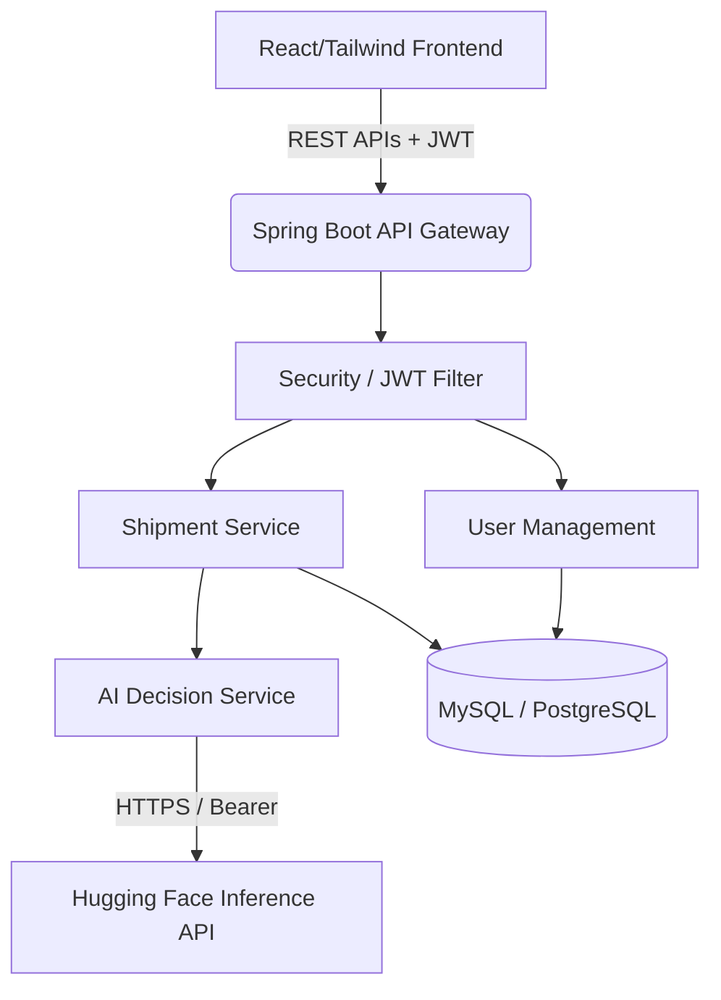

# 🌐 Track2Act: Next-Generation AI Supply Chain & Logistics Ecosystem

<div align="center">


**Real-time shipment tracking, predictive AI decision-making, and intelligent SaaS logistics management for modern enterprises.**

[Features](#-core-features) • [AI Integration](#-ai-decision-intelligence) • [Architecture](#%EF%B8%8F-system-architecture) • [Getting Started](#-deep-dive-installation--setup) • [API Reference](#-comprehensive-api-documentation)

</div>

---

## 🚀 Overview

**Track2Act** transcends traditional logistics software. It is an **enterprise-ready, full-stack Platform-as-a-Service (PaaS)** enabling end-to-end visibility of regional and cross-border supply chains. By merging dynamic GPS telemetry with leading AI foundation models (via the Hugging Face Inference API), Track2Act automates routing exceptions, manages driver fleets, and presents analytics through a stunning, glassmorphism-infused user interface.

Whether you're moving temperature-sensitive pharmaceuticals or bulk manufacturing materials, Track2Act manages the complexity of the modern supply chain across six distinct user roles.

---

## 🧠 AI Decision Intelligence

### *Powered by Hugging Face*
Track2Act utilizes Generative AI to act as an automated supply chain analyst. 

The backend routinely monitors active shipments (via the **Shipment Agent** engine) and passes context—including origin, destination, cargo type, and status delays—to large language models (like `Mixtral-8x7B-Instruct`) hosted on Hugging Face.

**Capabilities:**
- **Route Deviation Analytics:** Automatically processes traffic or weather alerts to suggest alternative routes, complete with cost vs. time impact calculations.
- **Carrier Switching:** Predicts and mitigates mechanical breakdown failures by suggesting fallback carriers.
- **Inventory Reallocation:** Suggests hub-to-hub movements of stock based on dynamic regional demand spikes.
- **Risk Calculation:** Calculates confidence scores (0-100%) for every automated decision and checks actions against pre-configured enterprise guardrails.

---

## ✨ Core Features

The platform operates heavily on an RBAC (Role-Based Access Control) system, providing tailored dashboards and tailored privileges.

### 🌐 Universal Tracking (Public)
- **Zero-Friction Monitoring:** Anyone with a tracking number can view live GPS coordinates and shipment history on an interactive 2D Map (powered by React Leaflet).
- **Milestone History:** A chronological audit of every step in the logistics chain.

### 🏢 Company Officer / Port Manager
- **Fleet Command Center:** Create complex shipments, assign them dynamically to available drivers, and manage global capacity.
- **Intelligent Dashboard:** View active operations overlaid with the AI Decision Intelligence engine, approving or rejecting automated interventions.
- **Task Delegation:** Frictionless assignment notifications to Drivers.

### 🚚 Driver Ecosystem
- **Live Task Polling:** A dedicated workspace tracking assigned routes and delivery checkpoints.
- **Geolocation Updates:** Submit real-time positional data pushing events into the central Apache/Kafka-inspired data bus.
- **Proof of Delivery:** Update statuses to `DELIVERED`, `DELAYED`, or `AT_RISK` directly from the mobile-first progressive web views.

### 👑 System Administrator
- **God-Mode Data Grid:** Full visibility into the user pool.
- **Security & Audits:** Monitor login history, revoke compromised JWT tokens, and force-kill specific sessions.
- **Analyst Reporting:** Export granular analytics and telemetry data.

---

## 🏗️ System Architecture

Track2Act is built as a highly uncoupled Monolith (ready for Microservices migration), communicating strictly over REST.



### Frontend Breakdown
- **React 18 & Vite:** Lightning-fast HMR and minimal bundle sizes.
- **Tailwind CSS & shadcn/ui:** Utility-first CSS coupled with extremely customizable primitive components.
- **Framer Motion:** Every interaction (from card expansions to page routing) feels fluid, spatial, and inherently premium.
- **Axios Interceptors:** Global token hydration on every outbound API request.

### Backend Breakdown
- **Java 17 & Spring Boot 3:** The industry standard for robust, type-safe API generation.
- **Spring Security + JWT:** Stateless authentication ensuring horizontal scaling capabilities without session affinity issues.
- **Spring Data JPA:** Abstracted ORM mapped tightly to our Relational entities.

---

## 🛠️ Deep-Dive Installation & Setup

### Prerequisites
- **Node.js**: v18.0.0+
- **Java Development Kit (JDK)**: v17+
- **Maven**: v3.8+
- **MySQL**: v8.0+ 
- **Hugging Face Account**: You need an active Inference API key.

### Step 1: Database Setup
1. Open your MySQL client and create the primary database:
   ```sql
   CREATE DATABASE track2act_db;
   ```

### Step 2: Backend Configuration
1. Navigate to the backend directory:
   ```bash
   cd track2act/backend
   ```
2. Open `src/main/resources/application.yml` and configure your credentials. **Crucially, insert your Hugging Face API key** to enable the AI engine:
   ```yaml
   spring:
     datasource:
       url: jdbc:mysql://localhost:3306/track2act_db
       username: root
       password: root
   
   huggingface:
     api-key: "YOUR_HF_API_KEY_HERE"
     api-url: "https://api-inference.huggingface.co/models/mistralai/Mixtral-8x7B-Instruct-v0.1"
   ```
3. Boot the API server:
   ```bash
   mvn clean install
   mvn spring-boot:run
   ```
   > The backend will spin up and expose REST endpoints at `http://localhost:8080`.

### Step 3: Frontend Configuration
1. Navigate to the React workspace:
   ```bash
   cd track2act/frontend
   ```
2. Install npm dependencies:
   ```bash
   npm install
   ```
3. Ignite the development server:
   ```bash
   npm run dev
   ```
   > The UI will compile instantly and deploy locally at `http://localhost:5173`.

### Environment Credentials
The system comes with a seeded initial Super-Admin user allowing you to bypass the need to touch SQL manually:
- **Email:** `shivansh@admin.com`
- **Password:** `9820689183`

---

## 📚 Comprehensive API Documentation

### System Core & Auth
| Method | Endpoint | Description | Auth Required |
|--------|----------|-------------|---------------|
| `POST` | `/api/auth/register` | Register a new user | ❌ |
| `POST` | `/api/auth/login` | Retrieve a JWT Bearer Token | ❌ |
| `GET` | `/api/auth/me` | Hydrate the current user session context | ✅ |

### Logistics & Tracking
| Method | Endpoint | Description | Auth Required |
|--------|----------|-------------|---------------|
| `GET` | `/track?id={hash}` | Public anonymous query string resolver | ❌ |
| `GET` | `/api/shipments/active`| Retrieve ongoing logistics | ✅ (Company/Admin) |
| `POST` | `/api/shipments` | Ingest a new shipment into the DB | ✅ (Company) |
| `GET` | `/api/shipments/driver/{id}` | Driver's assigned payload list | ✅ (Driver) |
| `POST`| `/api/shipments/location-update`| Push GPS telemetry to the shipment ledger | ✅ (Driver) |

### Artificial Intelligence
| Method | Endpoint | Description | Auth Required |
|--------|----------|-------------|---------------|
| `GET` | `/api/decisions` | Queries the Hugging Face AI to dynamically generate recommendations based on live shipment variables. | ✅ (Company/Admin) |

---

## 🧪 Validating the AI Integration

To successfully test the newly integrated predictive AI system:
1. Login as the **Company Officer** (or Admin).
2. Ensure you have at least 1-3 active shipments in the database possessing a status of either `IN_TRANSIT`, `DELAYED`, or `AT_RISK`.
3. Navigate to the **Decision Intelligence** sidebar tab.
4. The system will hold in a `(loading/generating)` state while the Java Spring Boot backend fires a payload via REST to your configured Hugging Face model.
5. Watch as the UI populates with multi-variable JSON recommendations including *Pros*, *Cons*, *Confidence Metrics*, and *Implementation Risks*.

---

## 🗺️ Long-Term Roadmap

### Phase 2: Q3 Edge Analytics
- [ ] Migrate AI polling from `HTTP GET` calls to a real-time WebSocket connection.
- [ ] Integrate Stripe for programmatic billing of complex multi-carrier shipments.
- [ ] Implement Redis caching on the AI endpoints to prevent Hugging Face rate limits on frequent dashboard reloads.

### Phase 3: Q4 Mobile & IoT Connect
- [ ] Stand up a React Native client for Drivers featuring background GPS tracking (bypassing battery management limiters).
- [ ] Physical BLE (Bluetooth Low Energy) beacon support for validating cargo container integrity.

---

## 🤝 Contribution Guidelines

This repository relies on community excellence. To contribute:
1. Fork the `track2act-v1-main` repository.
2. Initialize a branch adhering to Semantic Versioning formatting: `git checkout -b fix/auth-token-refresh` or `git checkout -b feat/ai-caching`.
3. Commit tightly scoped changes with declarative commit messages.
4. Issue your Pull Request against the `develop` trunk.

**For critical security disclosures (JWT leaks, RBAC bypasses), please contact support directly rather than opening a public issue.**

---

<div align="center">
<p>Developed with ❤️ by the Track2Act Engineering Team.</p>
</div>
